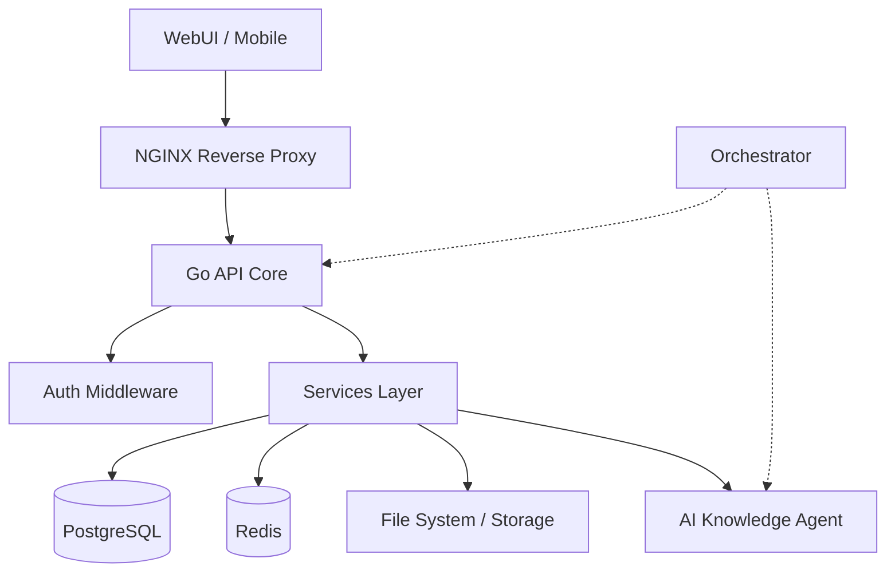

# NAS AI Server System

[](https://go.dev/)
[](https://reactjs.org/)
[](LICENSE)

**Secure, Self-Hosted NAS with Integrated AI Knowledge Base.**

Ein sicheres, selbst-gehostetes NAS-System mit integrierter RAG-KI, Hybrid-Verschlüsselung und moderner Web-Oberfläche.

---

## 🏗 Architecture



---

## ✨ Key Features

*   **🧠 AI Core**: Lokale Wissensdatenbank (RAG) mit Ollama-Integration für intelligente Dokumentenanalyse.
*   **🔒 Security**: ChaCha20-Poly1305 Hybrid-Verschlüsselung, Zip-Slip Protection und strikte Validierung.
*   **🚀 Performance**: Go-Backend mit asynchronen Job-Queues (Redis) für schnelle Antwortzeiten.

---

## 🚀 Quick Start

Starten Sie das gesamte System mit Docker Compose:

```bash
git clone https://github.com/frnd1406/NasServer.git
cd NasServer/infrastructure
docker-compose up -d --build
```

---

## 📚 Documentation

*   [**Backend API**](./infrastructure/api/README.md)
*   [**Web Dashboard**](./infrastructure/webui/README.md)
*   [**Orchestrator**](./orchestrator/README.md)
*   [**Developer Guide**](./docs/development/DEV_GUIDE.md)
